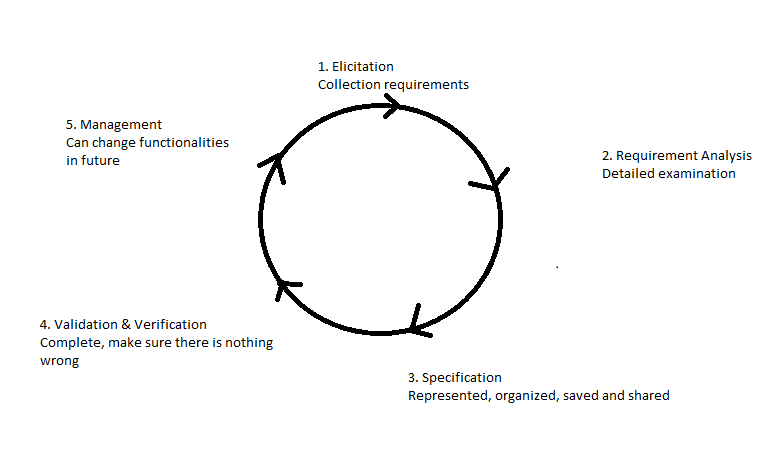

## What is Software Process:

* In software engineering, a software development process is the process of dividing software development work into distinct phases to improve design, product management, and project management. It is also known as a software development life cycle.

1. Waterfall process - the process we go from one phase to the other
2.Evolutionary prototyping - instead of following the waterfall process we start an initial prototype and evolve it.
3. Rational Unified Process - FOUR distinct Phases each involve business, modeling, analysis and design, implementation testing and deployment.
4. Agile - to comfort changes.

---

## Traditional Software Phases:
1. Requirements Engineering - Talk to the client to who we are building the software for.
2. Design
3. Implementation - work on the code
4. Verification and validation - make sure there are no errors and verify it's working
5. Maintenance - Keeping everything working adding new functionalities or getting rid if bugs

---

## What is the Software lifeCycle?
The sequence of decisions that determine the history of your software.

---

## Requirements Engineering:
Is the Process of establishing the needs of stakeholders that are to be solved by software.

--- 

## WATERFALL PROCESS:

* Software concept
    * Requirements Analysis
        * Architectural design
            * Detailed Design
                * Coding & debugging
                    * System Testing

---

## SPIRAL PROCESS MODEL:
Is an  incremental risk-oriented life cycle model that has FOUR main phases (A software project will go through this four phases.):
1. Determine objectives
    * Requirements will be gathered
2. Identify and resolve risks
    * The risk and the alternate solutions will be identified and a prototype will be produced.
3. Development and test
4. Plan the next iteration
    * The output of the project so far is evaluated and the next iteration is planned 

---

## AGILE:
Is a group of software development methods that are based on highly iterative and incremental development. (There are 3 main Phases):

---

## How to choose the write Model??
Need to take into consideration many factors. Need to be aware of what level of understanding we have of the requirements. 

* Do we understand all the requirements? 
* Are we going to be able to collect all the information in advance or is it going to be hard? 
* if the project is going to take a very long or short time to put together? 
* the level of risk involved. 
* Do we know the domain very well? 
* Do we know exactly the technologies involved? 
* how much time you have to complete the project?
* What are the expectations of the client for this project? 
* The level of expertise of the team.
