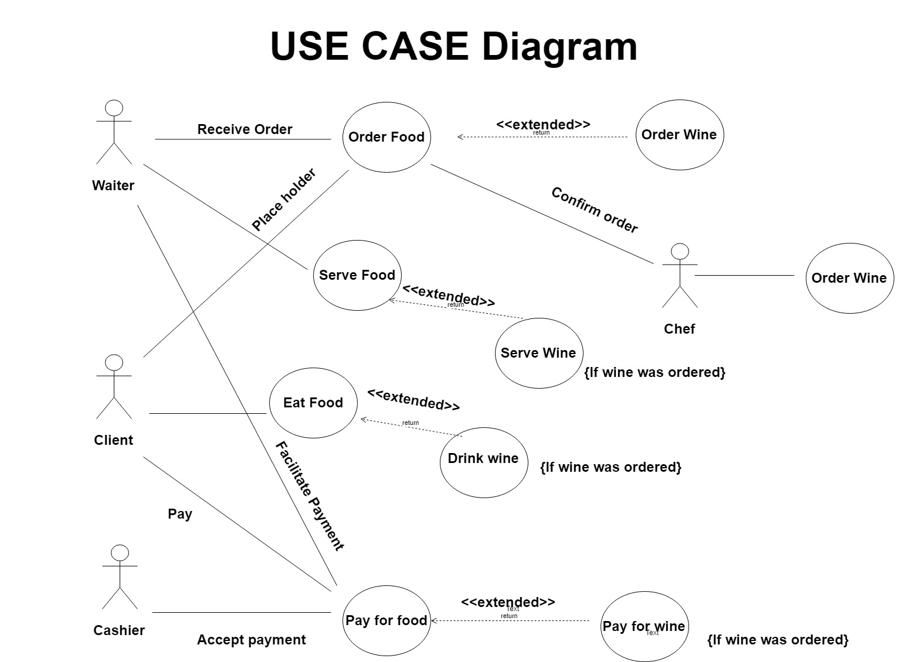

## Object Orientation:
* Is a programming language model organized around objects rather than “actions” and data rather than logic.
* A program has been viewed as a logical procedure that takes input data, process it, and produces output data.

---

## Object: 
Computing unit organized around a collection of state or instance variable that defines the state of the object.

---

## Class:
Template, blueprint from which are used to create new objects, and to define object data types and methods.

---

## Benefits of Object orientation:
* Reduce maintenance cost 
* Improve development process
* Enforce good design

---

## Course Management System:
Is a collection of software tools providing an online environment for course interactions.

---

## Class Diagram:
Static, structural view of the system
Describes: classes and their structure relationships among classes

---

## Attributes:
* Represents the structure of a class 
* May be found by:
    * Examining class definitions
    * Studying requirements
    * Applying domain knowledge

---

## Operations:
* Represented the behaviour of  a class
* May be found by examining interactions among entities

---

## Class Diagram: Dependency Relationship:
Expresses the relationship between a supplier and a client that relies on it. There is a dependency because changes in the supplier can affect the client.

---

## Kanban (development):
* Inspired by Toyota Productions System
* Is a lean method to manage and improve work across human systems. This approach aims to manage work by balancing demands with available capacity and by improving the handling of system-level bottle-necks

--- 

## Scrum (software development):
Is an agile framework within which people can address complex adaptive problems,while productively and creatively delivering products of the highest possible value.
Scrum itself is a simple framework for effective collaboration on complex products.

---

## Scrumban:
* Is an agile development methodology that is a hybrid of scrum and kanban. Scrumban emerged to meet the needs of teams wanting minimize the batching of work and adopt a pull-based system. 
* It was developed as an attempt to make it easier for existing scrum teams to begin exploring lean and kanban concepts.

---

## Extreme programing:
Is a software development methodology which is intended to improve software quality and responsiveness to changing customer requirements.

---

## Code Refactoring:
Is the process of structuring existing computer code, changing the factoring without changing it's external behavior.
Refactoring is intended to improve non-functional attributes of the software
Improve code readability and reduced complexity.

---

## Pair programming:
Is an agile software development technique in which two programmers work together at one workstation. One writes code while the other reviews each line of code as it is typed in. The two programmers switch roles frequently.

---

## User Story:
Is a tool used in Agile software development to capture a description of a software feature from an end-user perspective. The user story describes the type of user what they want and why. A user story helps to create a simplified description of a requirement.

---

## Creation Tips:
* Understand the problem
* Choose good names
* Concentrate on the what
* Start with a simple diagram
* Refine until you feel it is complete

---

## Unified Modeling Language (UML):
Is a standard language for specifying, visualising, constructing and documenting the artifacts of software systems.

---

## Component diagram:
* static view of components and their relationships
* Node = component - set of classes with a well defined interface
    * (A node is anything with an IP address ex, computer, cell phone, printer.
A point at which lines or pathways intersect or branch; a central or connecting point.)
* Edge = Relationship - uses services of
    * Can be used to represent an architecture

---

## Deployment Diagram:
* Static deployment view of a system
* Physical allocation of components to computational units.

* Example: a client-server system in which you’ll have to define which components will go on the server and which component will go on the client.
* Node = Computational unit (an specific device)
* Edge = Communication between the units

---

## USE CASE:
Represent two main things - Describes the outside view of the system
1. Sequence of interactions of outside entities (actors) with the system
2. System actions that yields on observable result of value to the actors

* Is a list of actions or event steps typically defining the interactions between a role and a system to archive a goal
* AKA - Scenarios, scripts or user stories

---

## USE CASE DIAGRAM:

---

## USE CASE: ACTOR
* Entity: human or device
* Plays a role:
    * An entity can play more than one role
    * More than one entity can play the same role
* May appear in more than one use case

---

## Documenting use cases:
The behavior of a use case can be specified by describing its flow of events.
* How the use case starts and ends
* Describe the normal flow of events
    * You are describing a use case for withdrawing money from an ATM. You may want to describe the normal flow of events in which I insert my card, I provide my pin and so on.
* Describe the alternative flow of events
    * To withdrawing cash, first ask some info about how much money is in my account.
* Describe the exceptional flow of events
    * Describe an exceptional flow of events in which I get my pin wrong and therefore Im not able to perform the operation. 

---

## An UML state transition diagram specifies:
* The events that cause an object to move from one state to another
* The effect of a state change

The following are UML structural diagrams:
* Class diagram
* Deployment diagram
