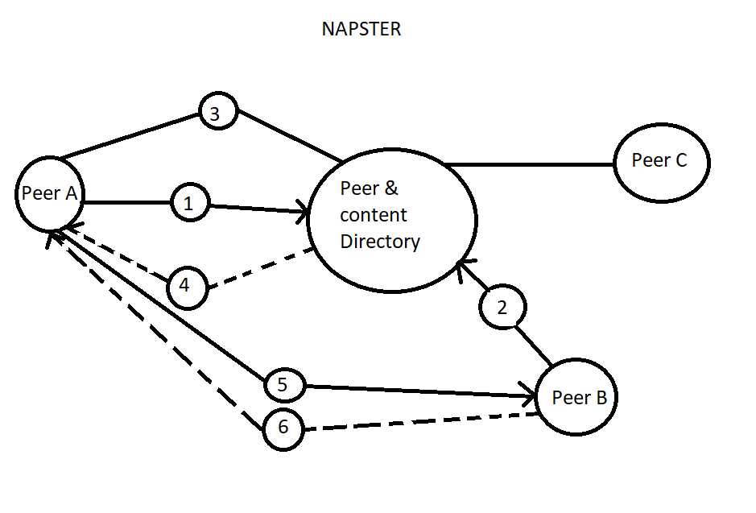
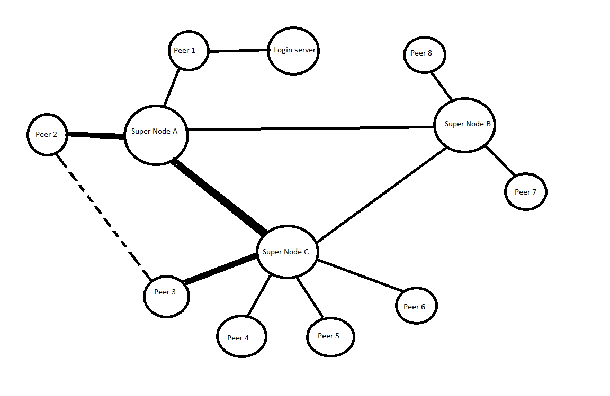

## What is software architecture?

* SWA = { Elements, Form, Rational}
* Elements(What) - The process, data and connectors that compose a software architecture.
* Form(How) - The set of properties of in relationships among these elements
* Rational(Why) - The justification for the elements and their relationships.

* General Definition Of SWA
    * Blueprint of a software System
    * Structure of the system
    * Behavior
    * Interaction
    * Non-functional properties

---

## Temporal Aspect SWA
* Not defined at once, but iteratively over time.
* At any point in time there is a SWA but it will change over time
* Design decisions are made, unmade and changed over a systems lifetime

---

## Prescriptive Architecture
Captures the design decisions made prior to the systems construction => as - conceived SWA

---

## Descriptive Architecture
Describes how the system has actually been built  => as implemented SWA

---

## Architecture drift
Introduction of architectural design decisions orthogonal to a systems prescriptive architecture.

---

## Architectural erosion
Introduction of architecture design decisions that violate a systems prescriptive architecture

---

## Bash
* Is a unix shell written as a free software replacement for the traditional Bourne shell also called SH.
* Bourne Shell is a shell or a command line interpreter.

---

## What is ideal characteristics of an architectural design?
* Scalability:
    * For software architecture is its ability to handle the growth of the  software system 
    * ex. For a web based system scalability could be the ability to handle a larger workload by adding new servers to the system.
* High cohesion:
    * Is a measure of how strongly related are the elements of a model.
* Low coupling:
    * Which is often correlated with high cohesion, is an important and ideal characteristic of a software architecture as it indicates that the different modules in the system are independent from one another. Each module provides a piece of functionality and it can provide it without relying to much on other modules.

---

## Software Architecture elements
* A software system architecture typically is not and should not be a uniform monolith. It should be a composition and interplay of different elements.
Monolith architecture: is the traditional unified model for the design of  a software program.
* Processing Elements: 
    * Are those elements that implement the business logic and perform transformations on data
* Data Elements:
    * Also called information or state, are those elements that contain the information that is used and transformed by the processing elements.
* Interaction elements: 
    * Are the glue that holds the different pieces of the architecture together.

* The processing elements and the data are contained into the system components, where as the interaction elements are maintain and controlled by the system connectors.
* And components and connectors get all cooked together into a system's configuration which models components, connectors and their relationships.

---

## Software Component
* Architecture entity that:
    * Encapsulates a subset of the system's functionality and/or data.
Restricts access to that subset via an explicitly defined interface.

---

## Software Connector:
* Is an architecture building block tasked with affecting and regulating interactions among components. So typically provide application independent interaction facilities.

---

## Architecture configuration: 
* Is a set of specific associations between the components and connectors of a software systems architecture.
* Sometimes architectural configurations can be represented as UML component diagrams.

---

## Architectural Styles:
* A named collection of architectural design decisions applicable in a given context.
* Should be a familiar with architectural styles what they are and in which context they work and in which context they do not work.

---

##Types of Architectural Styles
* Pipes and filter:
    * Indicate an architectural style in which a chain of processing elements which can be processes, threads coroutines, is arranged so that the output of each element is the input of the next one.
* Event Driven:
    * Typically consists of event emitters (like a fire alarm) and event consumer (like a fire truck) and consumers are notified when events of interest occur and have the responsibility of reacting to those events. 
    * Example: the react to the push of a button
* Publish Subscribe:
    * In which senders of messages they're called publishers, do not send messages directly to specific receivers. Instead, they publish messages with one or more associated text without knowledge of who will receive such messages.
    * An example: will be twitter
* Client Server:
    * In which computers in a network, assume one of wo roles. The server provides the resources and functionality. And the client initiates contact initiates contact with the server and requests the use of those resources and functionality.
    * Example: email, in which an email server provides email storage and management capabilities and an email client will use those capabilities.
* Peer-To-Peer: 
    * Is a type of decentralized and distributed network system in which individual nodes (branches) in the network, that are called peers, act as independent agents that are both suppliers and consumers of resources.
* Representational state Transfer (REST)
    * Is a hybrid architectural style for distributed hypermedia systems, that is derived from several other network based architectural styles and that is characterized by uniform connector interface. Governs the world wide web.

---

## MORE ABOUT PEER-TO-PEER (P2P):

* Examples Napster and Skype:

## Napster: 
* was a p2p file sharing system and it was mostly used to illegally share mp3’s

* 1 & 2 - register
* 3 - request for a song / the server will see that Peer B has the song (4) will send a handle to (5) connect with Peer B (6) sends request/content

## Skype (P2P)

* For a peer to get a connection with a nother peer (Peer 2 to Peer 3) Must connect with a Super Node (Super Node A to Super Node C) but if the connection goes wrong it finds another way. 

* After log in all you get is a connection through a super node
* Super nodes are highly reliable nodes with high bandwidth that are not behind a firewall and that runs skype regularly, which means that nodes that shut down skype occasionally will not qualify as super nodes (they are occured by skype, just regularly nodes that get promoted by skype supernodes and that know about each other)
