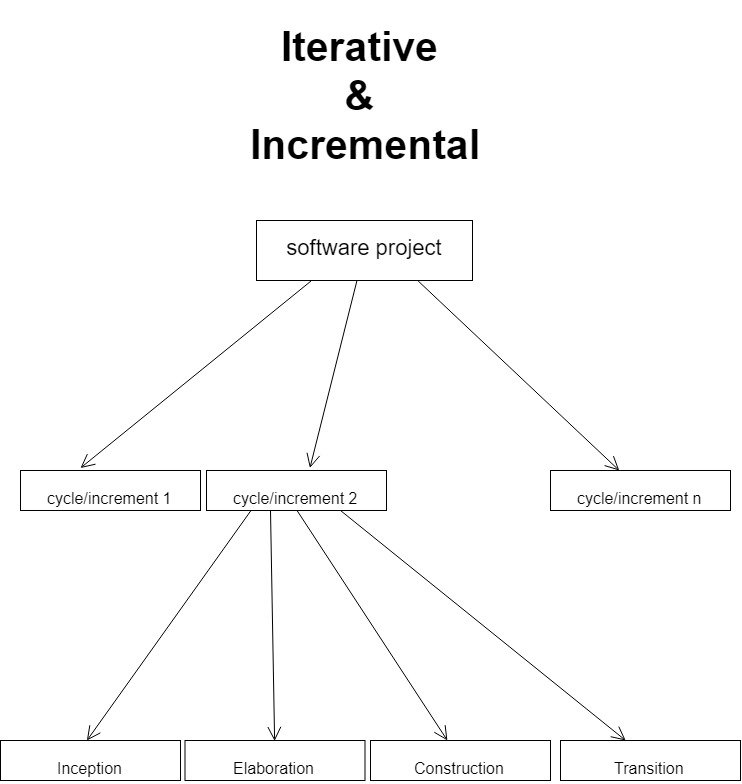

## Key Features of Rational Unified Process (RUP)
* Is a software process model
    1. Defines an order of phases that have to be followed 
    2. Prescribes transition criteria (when to go from one phase to the next)
* Component based
    1. Is defined and built as a set of software components (building blocks)
    2. Must be well-defined interfaces between these components, interfaces through which these components communicate.

--- 

## Tightly related to Unified Modeling Language (UML)
* Relies on UML for it's notation and to its basic principles

---

## Distinguish aspects
1. Use case driven
2. Architecture - centric
3. Iterative and incremental

---

## What is the difference between a use case and a use case model?
* A use case model is a set of use cases
* Use cases are meant to represent the high level functional areas of the system, as represented in a UML use case model (diagram). Primarily to analyze the different parts of the system and their relationships and dependencies.

---

## USE CASE DRIVEN
* A system performs a sequence of actions in response to user input.
* Use cases capture his interaction and answer the question “what is the system supposed to do for each user”? (types of users).
* Are used for support help each one of the following phases in the rational unified process: 
    1. Requirements engineering
    2. Design
    3. Implementation
    4. Verification and Validation
    5. Maintenance

---

## Software Architecture
* Is the view of the entire system that represents all high level principal design decisions.

---

## Architecture - Centric
* Use cases - define the function of a system (functionality)
* Architecture defines - defines the form of a system (structure)

---

## How to define a software architecture in the RUP?
1. Create a rough outline of the system (do it independently from the functionality)
2. Model aspects such as the platform on which the system will run, the overall style for example whether it's a client server or a peer-to-peer system.
3. Use the key use cases in the use case diagram to define the main subsystems of the architecture. For example in the case of a banking IT system, one of these subsystems might be the withdrawal system. What will happen in this case?
4. Will have some use cases that refer to the withdrawal activity and by analyzing that use case, well realize that we need a subsystem that implements that piece of functionality.

* Use the key use cases to identify and define the key subsystems for the architecture.
* Then keep defining the architecture by using additional use cases.

---

## Iterative and incremental
* Final distinguished aspect of RUP is that is iterative & incremental

---

## What does it mean by considering the lifetime of a software project?
* The lifetime of a RUP consists of a series of cycles/increments 
Each one of this cycles involve all of the main phases of a software development

---

## Iterative & Incremental
* Each cycle results in a product release (which can be internal or external) each cycle terminates with a product release that includes a complete set of artifacts for the project. That means code, manuals, use cases, non-functional specification, test cases and so on….
* Each cycle is divided in 4 phases 
* In each phase there may be multiple iterations
* What are these iterations??
    * Each iteration corresponds to a group of use cases that are selected so as to deal with the most iterations with less risky ones.

---

## Phases within a cycle
* Requirements engineering
    * Start in the inception phase, it's mostly perform in the elaborations phase and then it continues to a lesser extent through all phases, but it's mostly performed in elaboration.
* Analysis & Design
    * Are mainly perform in the elaboration phase but a considerable amount of it also continues in the construction phase, and then it phases out, and very little done in the transition phase.
* Implementation
    * Happens mostly in the construction phase, the phase that is mostly concerned with actual code development
* Test
    * Is performed throughout most phases in some specific points for example at the end of some iterations
* Business modeling
    * happens mainly in the inception and a little bit in the elaboration
* Deployment activity
    * Happens a little bit but the bulk of it is really done in the transition phase which is actually the phase that has to do with deployment and maintenance.

---

## What happens exactly within an iteration?
* In almost every iteration, developers perform the following activities:
    1. Identify which pieces of functionality this iteration will develop, will implement.
    2. After, will create a design for the considered use cases and they will do that guided by the chosen architecture.
    3. Once the design is defined, the developers will implement the design which will result in a set of software components.
    4. Then, will verify the components against the use cases to make sure that the components satisfy the use cases (will do that through testing or some other verification and validation activity)
    5. Finally, they will release a product, which also represents the end of the iteration.

---

##  What are the benefits of iterative approaches?
* Give developers early feedback
* Minimize risk of developing wrong system 
* Accommodate evolving requirements.

---

## Inception Phase
* From idea to vision of end product. What this involves is basically to determine the project scope, and making the business case for the product presented. Some questions will be asked: Why is it worth doing? What are the main risks? What are the success criteria? What resources will be needed?
* This phase answers 3 main questions…
    1. What are the major users and what will the system do for them?
    2. What could be an architecture for the system?
    3. What is the plan and how much it will cost?
* This phase generates several deliverables:
    * Division document: this is a document that provides a general vision of the core projects requirements, key features and main constraints, it also provides initial case model
* Additional variables are:
    * Initial project glossary - which describes the main terms using the project and their meaning.
    * Initial business case - which includes business context, and success criteria.
* Initial project plan and risk assessment
* [optional] one or more prototypes

---

## Elaboration Phase
* 4 main goals:
    1. Analysing problem domain
    * Establishing architectural foundation for the project
    * Eliminating highest risk elements
    * Refine plan of activities and estimates of resources to complete the project

    * Outcome:
        * Almost complete use-case model
        * Supplementary requirements, including non-functional requirements.
        * Software architecture
        * Design model, test cases, executable prototype
        * Revised project plan and risk assessment
        * Preliminary user manual (describes to the users how the system can be used and should be used)

---

## Construction Phase
* Where actual development occurs
* All features considered are developed
* All features thoroughly tested
* From IP development to product development

* Outcome:
    * Product that is ready to be deployed to the users
    * All use cases realized, with traceability information
    * Software product integrated on adequate platforms (all needed platforms)
    * Complete system test results
    * User manual (ready for users)
    * Complete set of artifacts: design, code, test cases

---

## Transition phase
* Ready to be deployed
* Main activities:
    * Issues after deployment = new release 
    * Training customer service and providing help-line assistance
    * A new cycle may start
* Outcome:
    * Project completed
    * Product in use
    * Lesson learnt (what works and what doesn’t)
    * Plan for next release
